# ace_laser_fatt_app

----
[](https://github.com/ellerbrock/open-source-badges/)
[](https://opensource.org/licenses/MIT)

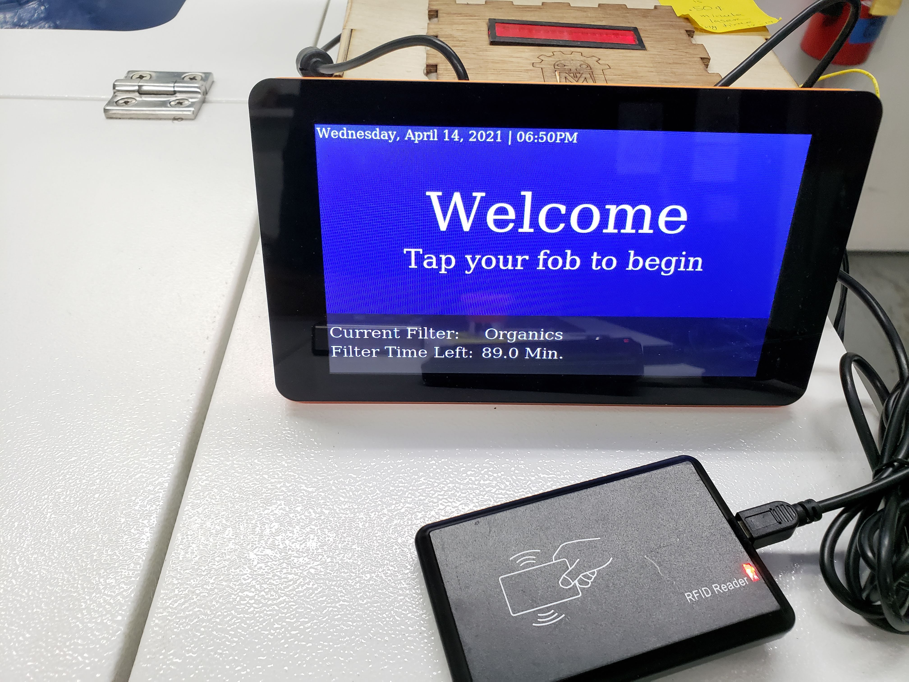

<h2 align="left">Ace laser fob all the things app is a laser cutter access control system</h2>

<!-- <h4 align="center">________________________</h4> -->

# Summary
### - *[Project Overview](#project-overview)*
### -  *[Project Photos](#project-photos)*
### -  *[Quick start](#Quick-start)*
### -  *[Installation](#Installation)*
### -  *[For developers](#For-developers)*
### -  *[Contributors](#Contributors)*
### -  *[API](#API)*
### -  *[License](#License)*


---
# Project Overview
### Ace laser fob all the things app is a *laser cutter* access control system that allows Ace Makerspace to charge $/min for laser cutting time.  It allows users to log laser usage time, using *RFID keys* to authenticate which user is actively logged in. 

##### The hardware used is: a Raspberry Pi, a touch screen, a RFID reader and a custom built electronic laser cutter interface built upon a teensy microcontroller.

-----------------
# Project Photos
- 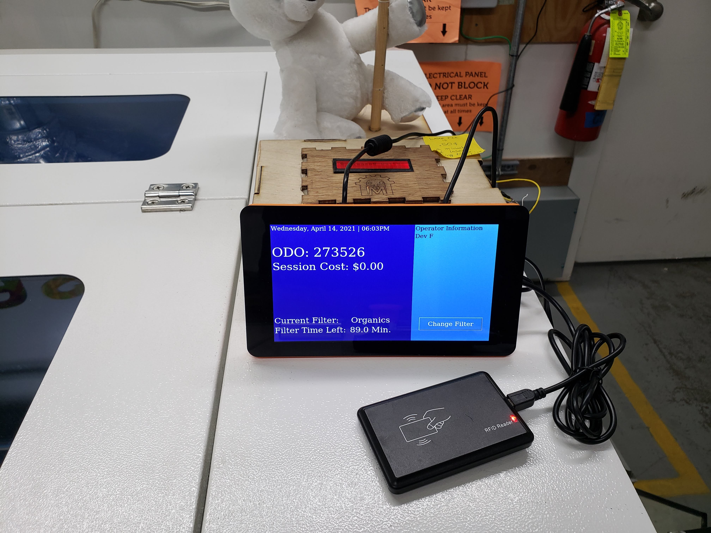 
-  
- 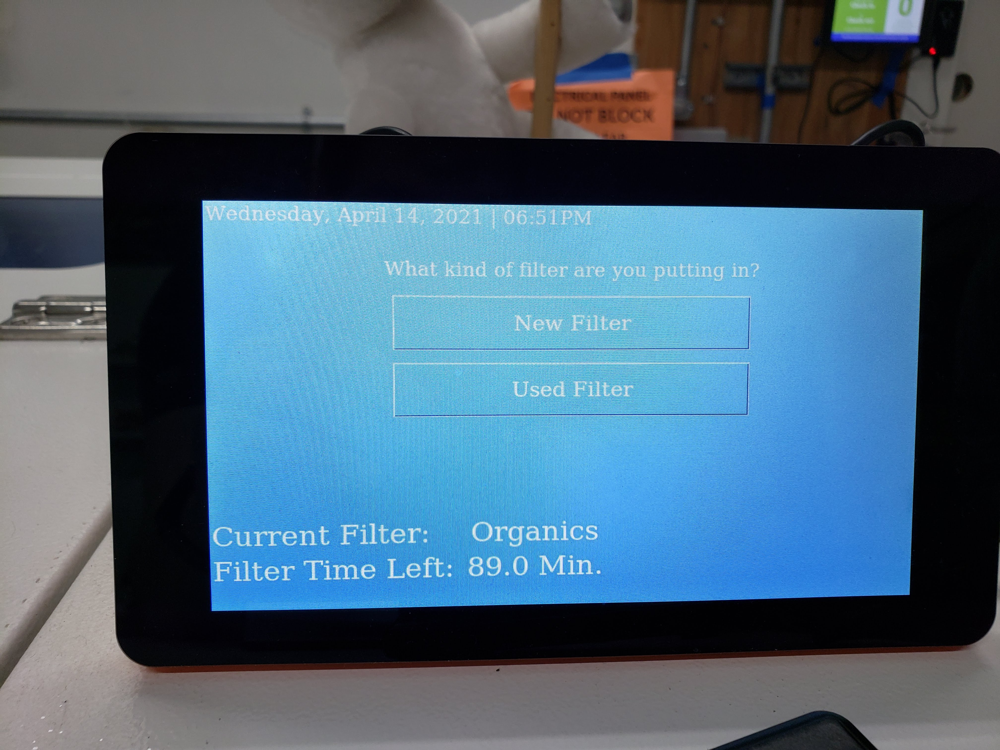 
- 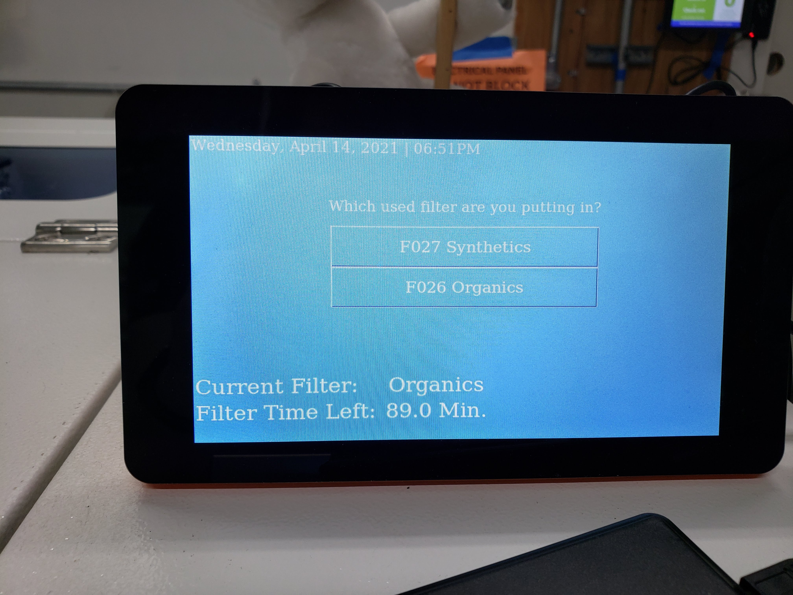 
- 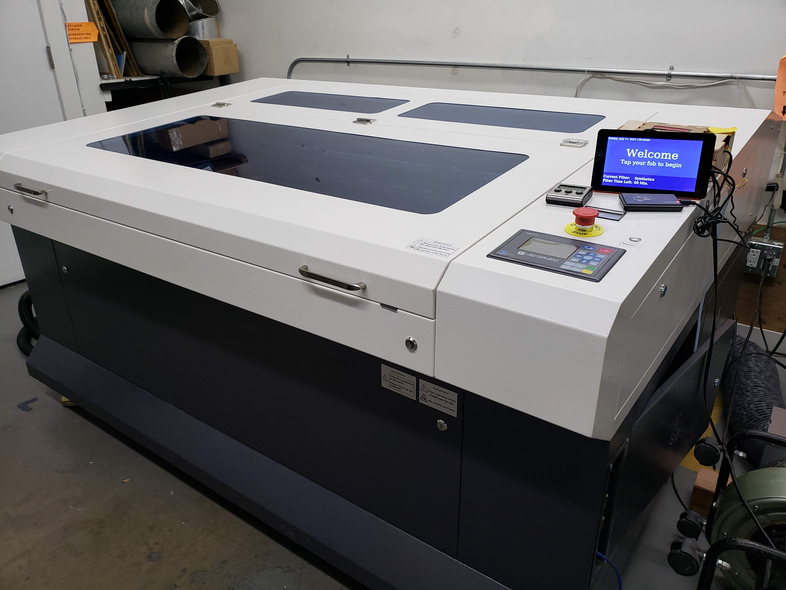 
- 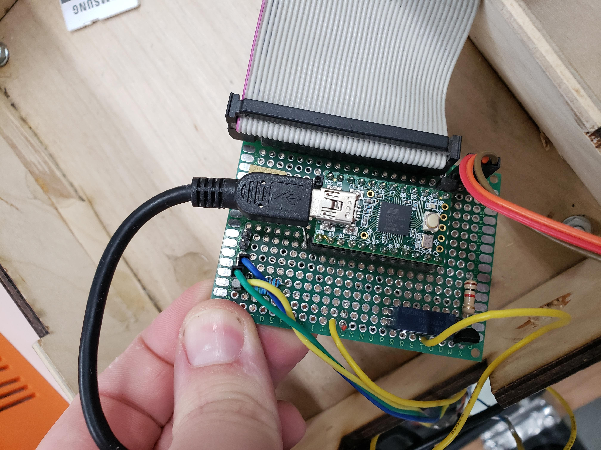 
- 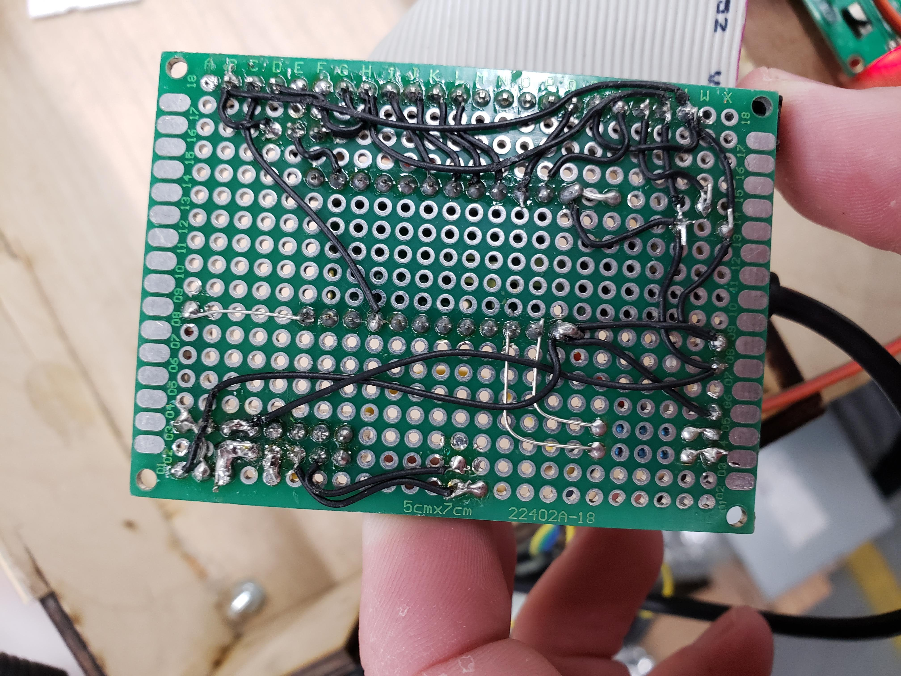 
- 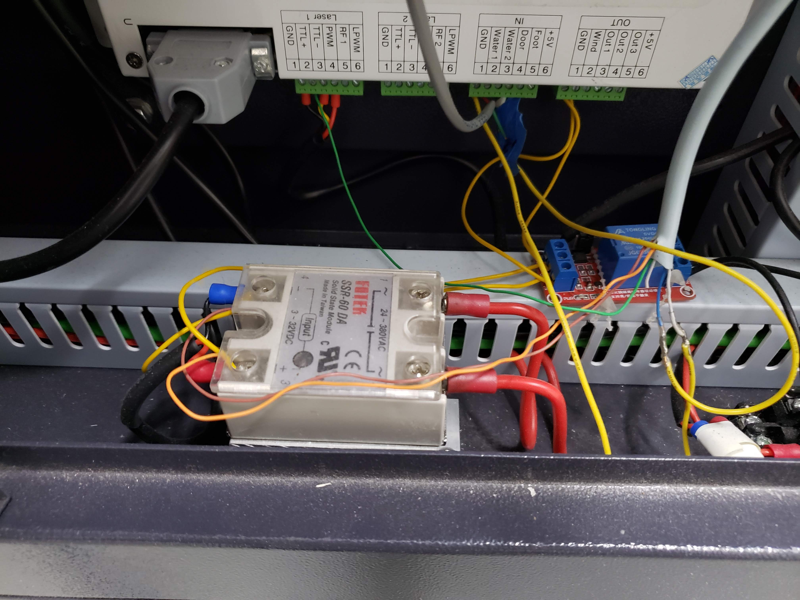 
- 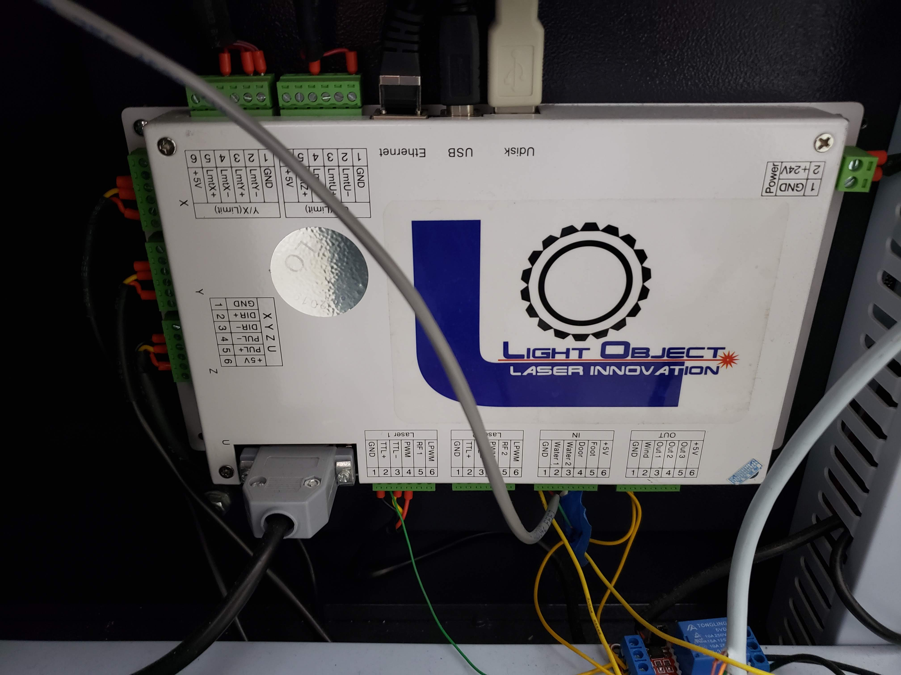 
 

# Quick start
### for all the commands in one block

##### for more details about the commands see *[Installation](#Installation)*
```bash
sudo apt-get update
sudo apt-get upgrade
cd ~
git clone https://github.com/acemonstertoys/fatt_device
cd ./fatt_device
pip install -r requirements.txt
touch prod.env
nano prod.env # add env variables here
sudo ln -s /home/pi/laserGui/systemd/kiosk.service /etc/systemd/system/kiosk.service
sudo systemctl daemon-reload
sudo systemctl enable kiosk.service
sudo systemctl start kiosk.service
# to stop run 
sudo systemctl stop kiosk.service
# to stop disable 
sudo systemctl disable kiosk.service
``` 


---
# Installation

Bellow is instructions for preparing the Raspberry Pi, acquiring the app, configuring the app, as well as starting and stopping the app through the systemd service.

### 1. Update the Pi:
```bash
sudo apt-get update
sudo apt-get upgrade
```
### 2. Clone this repo: 
#### Clone this repo into a directory named *laserGui* in the pi user's home directory. This path is referenced in the service that starts the app.
```bash
cd ~
git clone https://github.com/acemonstertoys/fatt_device
cd ./fatt_device
```
### 3. Install dependencies using requirements.txt: 
##### The laser GUI app is a python built on [guizero](https://lawsie.github.io/guizero/), and as such it has a number of dependencies. 
```bash
pip install -r requirements.txt
```
### 4. Create a ```prod.env``` file to define the following enviroment vaiables:
#### Note: They are not stored in this repo as they are considered sensitive information.

| Key               | Description                                                                           | Default Value  |
| ----------------- | ------------------------------------------------------------------------------------- | -------------- |
| ACE_ACCESS_URL    | the access list URL                                                                   | none, required |
| ACE_EXPORT_TOKEN  | used with ACE_ACCESS_URL                                                              | none, required |
| ACEGC_ASSET_ID    | the Assest ID of the pi                                                               | none, required |
| ACEGC_ASSET_TOKEN | auth token                                                                            | none, required |
| ACEGC_BASE_URL    | base URL to Grand Central                                                             | none, required |
| ACEGC_LASER_COST  | the cost in cents per minute of laser firing                                          | 0.5            |
| LASER_LOGOUT_TIME | number of inactivity minutes which invokes a logout                                   | 40             |
| LASER_ODO_POLLING | the time interval used to continously poll the laser for odometer reading, in seconds | 15             |

#### Example `prod.env` file:
```toml
# [prod.env]
ACE_ACCESS_URL=
ACE_EXPORT_TOKEN=
ACEGC_ASSET_ID=
ACEGC_BASE_URL=
ACEGC_LASER_COST=
LASER_LOGOUT_TIME=
LASER_ODO_POLLING=
```

### 5. Link systemd file from this repo to ```/etc/systemd/system```
```
sudo ln -s /home/pi/laserGui/systemd/kiosk.service /etc/systemd/system/kiosk.service
```
### 6. Load service into systemd: 
```bash
sudo systemctl daemon-reload
```
### 7. Enable the service to start on restart: 
```bash
sudo systemctl enable kiosk.service
```
### 8. Start the service immediately: 
#### Please Note: Environment variables are required.
```bash
sudo systemctl start kiosk.service
```
### 9. If needed, stop the service temporarily: 
```bash
sudo systemctl stop kiosk.service
```
### 10. If needed, disable the service until it's enabled again:
```bash
sudo systemctl disable kiosk.service
```

----

# API
## Data type info

### Session Manager Data Types
| Name | Datatype | value |
| --- | --- | --- |
| credential   | ????? |  userDict['RFID'] | 
| authSuccess  | Boolean |   True/False | 
| member_id    | String |  userDict['UID'] | 
| start_time   | String |  UTC String EX'2021-07-24 16:03:43.415006' | 
| end_time     | String |  UTC String EX'2021-07-24 16:03:43.415006' (python datetime.now()) | 
| start_odo    | int |   Ex 0 | 
| end_odo      | int |  laser.py laserInterface.odometer EX: '0' | 
| CURRENT_TIME | String |  UTC String EX'2021-07-24 16:03:43.415006' | 


### Filter Data Types
| Name | Datatype | value |
| --- | --- | --- |
| filterId         | int?????? |  |
| filterType       | int?????? |  |
| recordedUsage    | int?????? |  |
| odometerReading  | int?????? |   # TODO: what units is the odometer in? |
| odometerReading  | int?????? |  |
| GREEN_ORGANICS   | int (minutes) |  Green organics filters can be used for a total of 140 minutes  |
| WHITE_SYNTHETICS | int (minutes) |  White synthetics filter can be used for a total of 60 minutes  |
| Unknown          | int (minutes) |  Unknown filter type |

----

# SessionManager
## fetch_access_list
### POST /<ACE_ACCESS_URL>/
<!-- ### Description: fetch_access_list       -->
```
Pulls certified laser RFIDs from URL defined as an environment variable.
The json list contains only those user allowed to use the laser.
```
##### Request Example:
```json
{
    "headers":
    {
        "User-Agent": "Wget/1.20.1 (linux-gnu)"
    },
    "body":
    {
        "ace_export_token": <ACE_EXPORT_TOKEN>
    }
}
```
## postActivityListing
### POST /<ACE_ACCESS_URL>/activitylistings/
<!-- ### Description:        -->
##### Request Example:
```json
{
    "headers":
    {
        "Authorization": "Token <ACEGC_ASSET_TOKEN>",
    },
    "body":
    {
            "access_point": <ACEGC_ASSET_ID> ,
            "activity_date": <CURRENT_TIME (utc)>,
            "credential": <credential>,
            "success": <authSuccess>,
        }
}
```
##### Response Example:

| Code | Description |
| ---- | ----------------- |
| 200  | OK                |

## postLaserSession
### POST /<ACE_ACCESS_URL>/lasersessions/
### Description: postLaserSession      
##### Request Example:
```json
{
    "headers":
    {
        "Authorization": "Token <ACEGC_ASSET_TOKEN>",
    },
    "body":
    {
            "credential": <credential>,
            "member_id": <member_id>,
            "start_time": <start_time>,
            "end_time": <end_time>,
            "start_odo": <start_odo>,
            "end_odo": <end_odo>,
    }
}
```
##### Response Example:

| Code | Description |
| ---- | ----------------- |
| 200  | OK                |
------

# Filter Api calls
## create_new_filter
### POST `/<ACEGC_BASE_URL>/filters/`
```
Creates a new filter in Grand Central
```
##### Request Example:
```json
{
"header": {
    'Authorization': "Token <ACEGC_ASSET_TOKEN>",
    "Content-Type": "application/json"
},
"body": {
    'seconds_used': 0,
    'seconds_used': <totalUsage>, # TODO line 40: what units is the odometer in?
    'filter_type': <filterType>,

}
```
##### Response Example:

| Code | Description |
| ---- | ----------------- |
| 200  | OK                |

----

## fetch_existing_filters
### GET `/<ACEGC_BASE_URL>/filters/`
```
Fetch existing filters from GC
```
##### Request Example:
```python
header = {
    "Authorization": "Token <ACEGC_ASSET_TOKEN>",
    "Content-Type": "application/json"
}
requests.get("<ACEGC_BASE_URL>/filters/", headers=header)
```
##### Response Example:

```json
{
    "body": {
        [ //list of filters
            {
                "filter_type": <filterType "O": "GREEN_ORGANICS","S":"WHITE_SYNTHETICS">,
            },
            ...
        ]
    }
}

```

| Code | Description |
| ---- | ----------------- |
| 200  | OK                |
----

## updateRuntime
### PATCH `/<ACEGC_BASE_URL>/filters/<filterId>/`
##### updateRuntime: Calculates usage and posts it to Grand central
##### Request Example:
```json
{
    "header": {
        "Authorization": "Token <ACEGC_ASSET_TOKEN>",
    },
    "body": {
        "seconds_used": <totalUsage>,
    }
}
```

##### Response Example:

| Code | Description |
| ---- | ----------------- |
| 200  | OK                |
----
<!-- Options -->
<!-- payload -->
<!-- Sagger api stuff -->

# Hardware
### NOTE: the hardware is intended for experienced electrical engineers only. Your expected to build your own hardware interface with the laser you are using. We are only showing an example of how we've done ours.
### Teensy Interface
#### The interface is documented here: https://github.com/acemonstertoys/laser-rfid
### Bom
| Item | Quantity |
| ---- | ----------------- |
| USB cable | 1 |
| Raspberry Pi 3 | 1 |
| Teensy 2.0 24 pin version | 1 |
| Touch Screen (Raspberry Pi compatible) | 1 |
| RFID Reader (USB) | 1 |
| BC550 | 1 | 

### Circuit
-  
-  
-  
- 
### Schematic
- 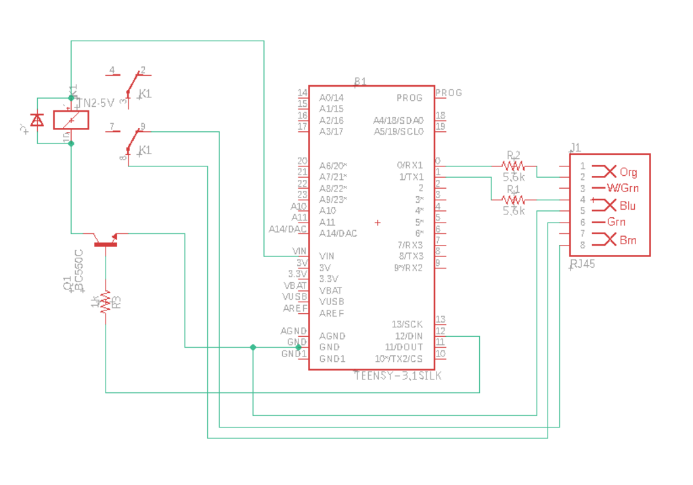 
- 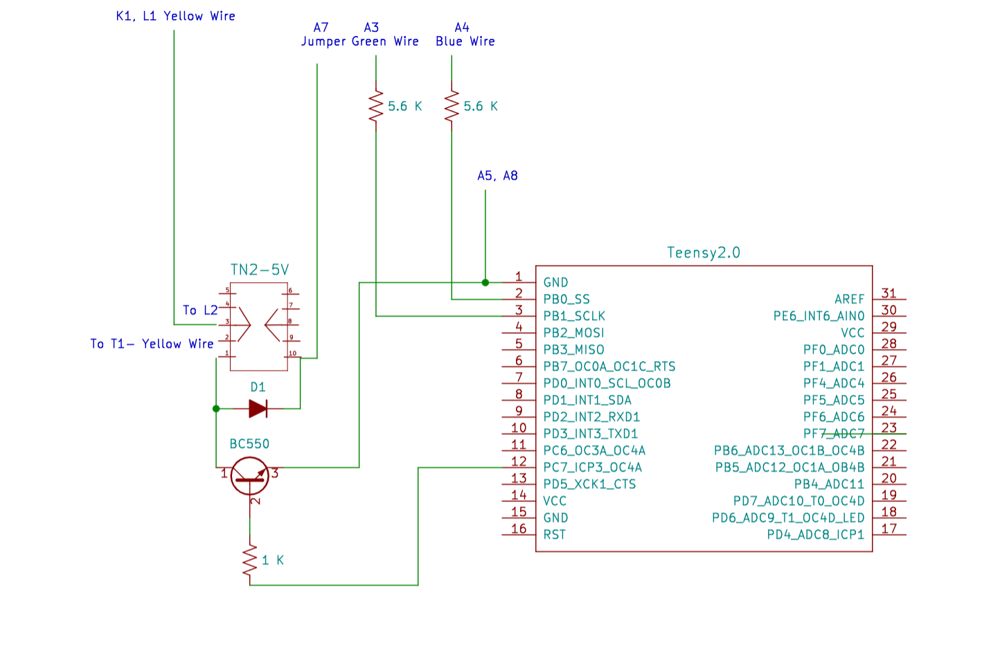 
-----------------
# For developers

### What each file does
*Graphical User Interace to the makerspace's laser.*
* images — images used in the GUI
* systemd — Systemd service used to automatically start the GUI
* filter.py — represents laser filters
* laser.py — Interface to the Teensy controller *(link TBD)*
* laserGui.py — GUI built on [guizero](https://lawsie.github.io/guizero/) which wraps standard Python Tkinter GUI library.
* laserSession.py — represents a user's session at the laser.
* requirements.txt — python library dependencies
* sessionManager.py — manages interactions between the GUI and users and filters


-----------------
# Contributors
[](https://github.com/acemonstertoys/ace_laser_fatt_app/graphs/contributors)

##### Made with [contributors-img](https://contrib.rocks).

-----------------
# License
#### MIT © Ace Makerspace
[](https://opensource.org/licenses/MIT)
#### Documentation Contributor [2021]
```bash
by oran collins
github.com/wisehackermonkey
oranbusiness@gmail.com
20210717
```